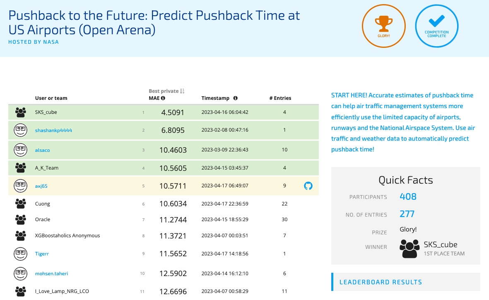

# Pushback to the Future: Predict Pushback Time at US Airports

This repository is my workflow for the NASA hosted competition [Pushback
to the Future
Challenge](https://www.drivendata.org/competitions/149/competition-nasa-airport-pushback/page/676/).
You can find more information on the Open Arena to include the specific
problem description, the full dataset, the leaderboard results, and more
by clicking on the hyperlink.

Although you will not have access to the Pre-screened Arena, you can
find information on the format of the competition on the [NASA Pushback
Runtime Github
Page](https://github.com/drivendataorg/nasa-pushback-runtime).

### [1 .Overview](#overview)

### [2. Python Workflow](#python-workflow)

-   [Pushback1](#pushback1)
-   [Pushback2](#pushback2)
-   [Pushback3](#pushback3)
-   [Solution](#pushback3)

### [3. Results](#results)

### [4. Data](#data)

## Overview

The goal of the competition is to use machine learning models to
prediction airport pushback time of departing flights (how long until
the plane departs from the gate) using features that capture air traffic
and weather conditions. Predictions must be generated for various
flights across different time periods starting approximately an hour
before the scheduled pushback time using only data from the past 30
hours.

More information regarding the problem description and the specifics of
the dataset can be found
[here](https://www.drivendata.org/competitions/149/competition-nasa-airport-pushback/page/677/).

## Python Workflow

I used pushback1.py to tune hyper-parameters for the lightgbm model, fed
those hyper-parameters into pushback2.py for the final training of the
model with all the data, and then used pushback3\_predict.ipynb to make
predictions on the evaluation data set and format the predictions in
accordance with the submission format provided by DrivenData in the Open
Arena.

In the Pre-screened Arena, I used the solutions.py or the
solutions\_na.py (I tested both) as opposed to using pushback3.py for
submission. For this arena, I used pushback2 to save my final lightgbm
models into .txt files. I then uploaded my models (.txt files) along
with the solution.py script where DrivenData used my script and models
to generate predictions for the evaluation dataset in a containerized
runtime in their cloud environment. More information can be found on the
[NASA Pushback Runtime Github
Page](https://github.com/drivendataorg/nasa-pushback-runtime).

I also note that I created 2 models for each airport: one for when all
weather data / lamp data is available and one for when it was not. Note
the \_na description in my python scripts show that those scripts were
used in training and executing predictions for when weather data was not
available.

In the sections below, I summarize the steps I took in each python
script.

### Pushback1

My pushback1 scripts were used for exploratory data analysis and
training of my gradient-boosted decision tree models.

-   pushback1.py: used for hyperparameter tuning of the lightgbm model
    -   Dataset was large so I used one train-test split (0.8/0.2) as
        opposed to cross-validation

\*pushback1\_na.py: same as pushback1.py but tuned without weather data

-   pushback1\_eda.ipynb: Used from exploratory data analysis and
    comparing which machine learning models worked better
    -   In this script, I also ran randomforest and lasso regression
        models.

#### Lightgbm

I used the ‘goss’ boosting method in lightgbm to tune and train my
models. Models were trained the training set and used the test set to
monitor the performance of the model to prevent overfitting. n\_jobs set
to -1 to maximize CPU usage in order to ensure the script is running as
quickly as possible.

#### Hyper-Parameter Tuning: The University of Texas at Austin Texas Advanced Computing Center (TACC)

I used the hyperopt package to tune hyper-parameters. This package
provides a convenient method for Bayesian Optimization when tuning
lightgbm models.

All hyper-parameter tuning using pushback1.py was done on TACC. I used
my personal computer to run a small-scale version of the code to ensure
my python1 script worked properly. Due to the size of the datasets, I
tuned 20 models- 2 for each airport with 50 iterations each. My search
space consisted of the following:

space = {  ‘num\_leaves’: hp.quniform(‘num\_leaves’, 100, 1000,
25),  ‘learning\_rate’: hp.loguniform(‘learning\_rate’, -4, 0), 
‘max\_depth’: hp.choice(‘max\_depth’, range(10, 21)),  ‘reg\_alpha’:
hp.uniform(‘reg\_alpha’, 0, 1),  ‘reg\_lambda’:
hp.uniform(‘reg\_lambda’, 0, 1),  ‘feature\_fraction’:
hp.uniform(‘feature\_fraction’, 0.5, 1)}

This allowed me to tune 10 models at once as opposed to tuning one model
at a time on a personal computer. Without TACC, this process would have
taken significantly longer. Each model took about 2-3 hours on TACC,
which is faster than most personal computers.

### Pushback2

-   pushback2.py: takes the best hyper-parameter values from
    pushback1.py and trains the final model with all available training
    data

    -   saves the final model as a .txt file so pushback3.py and
        solutions.py can load those models in order to generate
        predictions

-   pushback2\_na.py: same as pushback2.py but without weather data

-   pushback2\_model.ipynb: used for experimenting with the code

### Pushback3

-   pushback3\_predict.ipynb: generates predictions and saves them as
    .csv files for submission in the Open Arena
    -   loads the various models saved in .txt files
    -   loads the final testing data
    -   generates predictions on the test data
    -   converts predictions to the correct formats and saves that as a
        csv file for upload into the Open Arena
-   pushback3\_na.ipynb: same as pushback3\_predict.ipynb but without
    weather data

### Solution

-   solution.py: script for submission in the Prescreened Arena
    -   DriveData has a supervisor.py script that imports my trained
        models and solution.py
    -   This is done in a cloud environment where supervisor.py calls my
        predict function for every set of flights in an airport at a
        particular time (calls my predict function 1800 times).
    -   My predict functions generates predictions for each set of
        flights at an airport at the given times and converts
        predictions into the appropriate format
    -   supervisor.py takes those submissions and provides my mean
        absolute error score
-   solution\_na.py: same as solution.py but has an if statement to use
    the models trained without weather data in the case that evaluation
    data did not come with weather data

More information on the submission format can be found
[here](https://github.com/drivendataorg/nasa-pushback-runtime#code-submission-format).

## Results

I posted submissions on both the Open Arena And Pre-screened Arena. The
following show the Benchmark and my results as measured by the Mean
Absolute Error:

-   [Open
    Arena](https://www.drivendata.org/competitions/149/competition-nasa-airport-pushback/leaderboard/)

    -   Benchmark: 14.01
    -   My Model: 10.57

-   Pre-screened

    -   Benchmark: 19.35
    -   My Model: 12.57

    Snapshot of the Open Arena Leader Board. Note, I am axj65.

    

## Data

Much of the data used for this are provided in the
[data\_partial](https://github.com/axj65/airport_pushback_competition/tree/main/data_partial)
directory. However, the data used to train the model can be found on the
DrivenData competition page
[here](https://www.drivendata.org/competitions/149/competition-nasa-airport-pushback/data/)
as the file sizes were too large to upload to github.

Also note that for training, I used the prescreened\_train\_labels in
the
[data\_partial](https://github.com/axj65/airport_pushback_competition/tree/main/data_partial)
directory to retrieve particular flights. Out of all the 9 additional
csv files provided by DrivenData, I used only 3: etd.csv (provides
estimated runway departure time) lamp.csv (weather data), and mfs.csv
(information about each flight and its aircraft). It is also worth to
note that information provided on mfs.csv are simulated and not the
actual data.
